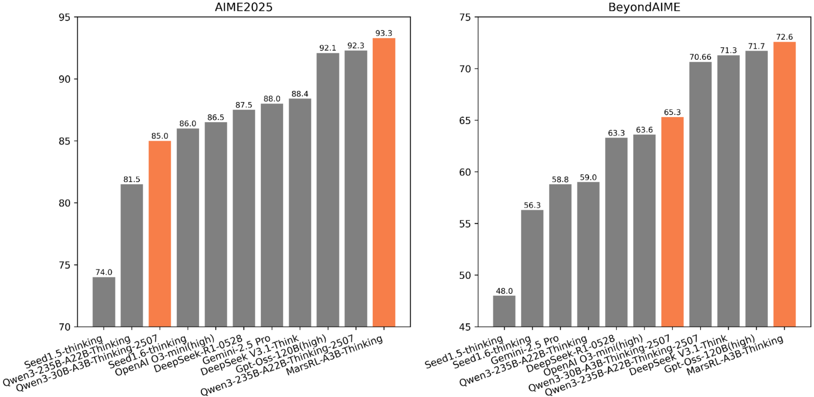

<div align="center">

#  MarsRL

<div>
   Advancing <strong>M</strong>ulti-<strong>A</strong>gent <strong>R</strong>easoning <strong>S</strong>ystem via <strong>R</strong>einforcement <strong>L</strong>earning with Agentic Pipeline Parallelism
</div>
<a href="https://arxiv.org/pdf/2511.11373">Paper</a> | <a href="https://huggingface.co/forestliutc/MarsRL" target="_blank">HuggingFace</a>
</div>

## Overview

Recent progress in large language models (LLMs) has been propelled by reinforcement learning with verifiable rewards (RLVR) and test-time scaling. However, the limited output length of LLMs constrains the depth of reasoning attainable in a single inference process. Multi-agent reasoning systems offer a promising alternative by employing multiple agents including Solver, Verifier, and Corrector, to iteratively refine solutions. While effective in closed-source models like Gemini 2.5 Pro, they struggle to generalize to open-source models due to insufficient critic and correction capabilities. To address this, we propose MarsRL, a novel reinforcement learning framework with agentic pipeline parallelism, designed to jointly optimize all agents in the system. MarsRL introduces agent-specific reward mechanisms to mitigate reward noise and employs pipeline-inspired training to enhance efficiency in handling long trajectories. Applied to Qwen3-30B-A3B-Thinking-2507, MarsRL improves AIME2025 accuracy from 86.5\% to 93.3\% and BeyondAIME from 64.9\% to 73.8\%, even surpassing Qwen3-235B-A22B-Thinking-2507. These findings highlight the potential of MarsRL to advance multi-agent reasoning systems and broaden their applicability across diverse reasoning tasks.
<div align="center">

</div>

## V-C Reasoning System Evaluation Instructions
### step1: Download our released model or other open source models
Supported models: Qwen3/DeepSeekV3.1/DeepSeek R1. You can modify the file "llm_client.py" to use other models.

### step2: Deploy service via VLLM

### step3: Run the V-C reasoning system by the following commands:
```
python3 vc_reasoning_system.py solver_ip_port_1,solver_ip_port_2,... vc_ip_port_1,vc_ip_port_2,... test_file output_dir
for example: python3 vc_reasoning_system.py 8.8.8.8:8021,12.34.56.78:8021 8.8.8.8:8021,12.34.56.78:8021 ./outputs/debug ./test_corpus/aime2025.jsonl
```
This step will run the reasoning system for each problem in the given $test\_file$, the predicted results can be found in the output_dir

### step4: Extract final solutions by the following commands:
```
python3 extract_solution.py result_dir test_file
for example: python3 extract_solution.py ./outputs/debug ./test_corpus/aime_2025.jsonl
```
This step will generate a file named "eval_overalljsonl" in the input_dir. You can evaluate the metrics based on this file.


## Acknowledgements
- Our implementation is heaviliy built on [verl](https://github.com/volcengine/verl).
- Our models are trained on top of [Qwen3-30B-A3B-Thinking-2507](https://huggingface.co/Qwen/Qwen3-30B-A3B-Thinking-2507).
- Our V-C Reasoning system is built on [IMO25 pipline](https://github.com/lyang36/IMO25).
  
Thanks for their wonderful work.

## Citation
```bibtex
@article{Marsrl2025,
    title = {MarsRL: Advancing Multi-Agent Reasoning System via Reinforcement Learning with Agentic Pipeline Parallelism},
    author = {Shulin Liu, Dong Du, Tao Yang, Yang Li, Boyu Qiu}
    year = {2025}
}
```
